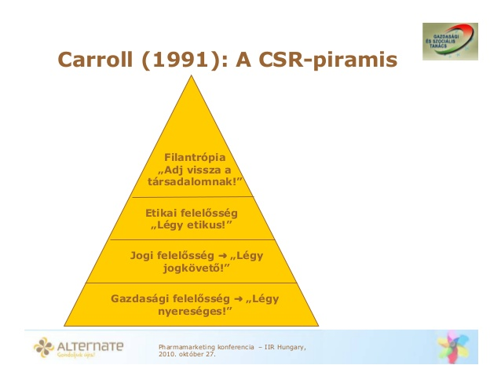
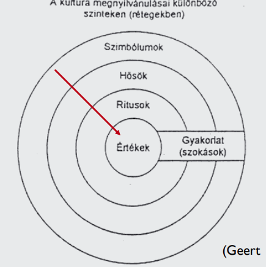
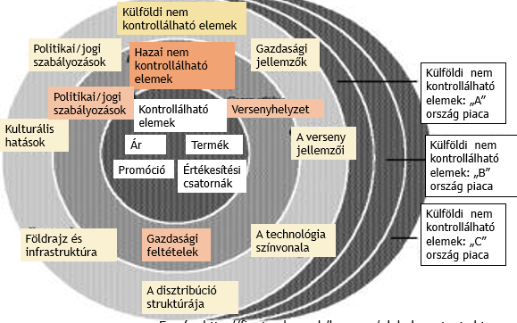
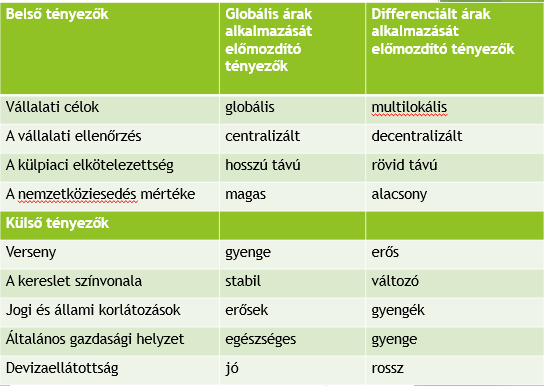

# Nemzetközi menedzsment

## Globalizáció (nemzetköziesedés)

1.  Kereskedelem nemzetközivé válása

2.  Termelés és tőkeáramlás több országra kiterjedése

3.  Innováció és információs folyamatok globalizációja

4.  hálózatok globalizációja

Több kontinensre kiterjedő tevékenység, világméretű standardizálás,
államok növekvő gazdasági kölcsönhatásai.

**Hajtóerői**: tőkeáramlási korlátok csökkenése, vámok csökkentése,
globális tőkepiac, világméretű hálózatok, nemzetközi pénzpiac, liberális
gazdaságpolitika

**Cél**: árbevétel és értékesítési volumen növelése, új erőforrás,
költségek csökkentése, lehetőségek diverzifikálása, innovációs előnyök

**Külső tényezők**: demográfia, gazdasági helyzet, kultúra,
globalizáció, kommunikáció

**Belső tényezők**: globalizáltság, eredet, menedzsment orientáció,
tudástranszfer

**Műveletek**: export – import, franchise, licenc, projektek,
szerződések, FDI

**Okai**: nyersanyag, új piac, munkaerő, rövidülő ciklusok, külföldi
kedvezmények (adó, vám), háttéripar, beszállítók, e-kereskedelem

**Kultúrafüggetlen irányzat**

A technológiai fejlődés elmossa a kulturális különbségeket; a
menedzselés módszerei univerzálisak → homogenizálás.

**Kultúrafüggő irányzat**

A menedzselés módszerei univerzálisak, DE adaptálni kell azokat az adott
nemzeti kultúra igényei szerint (Hofstede); a különféle menedzselési
technikák alkalmazásakor tekintettel kell lenni a helyi/nemzeti
kultúrákra.

**Köztes kultúra irányzat**

A konvergencia és a divergencia egyidejűleg áll fenn; a szituáció dönti
el a legmegfelelőbb közelítési módot.

**Nemzetközi menedzsment**

Minden olyan üzleti és közszolgálati tevékenység, melyet legalább kettő
vagy annál több országban végeznek az üzletmenet sikeres lebonyolítása
érdekében.

**Vállalatok társadalmi felelőssége**

A vállalatok által önként vállalt szerep, amelynek értelmében működésük
során és az érdekeltekkel való kapcsolatukban figyelmet fordítanak a
társadalmi és a környezetvédelmi problémákra.

**Szabadpiaci felfogás:** Friedman nem vonja kétségbe a törvényekben,
illetve erkölcsökben megtestesülő „játékszabályok” betartásának
fontosságát. Azt képviseli azonban, hogy az alapvető szabályok
betartásán túl semmi több nem várható el a vállalatoktól, mint saját
profitérdekük következetes képviselete.

## Carroll – CSR-piramis:

**Stakeholder elmélet**: „Érintett” minden olyan csoport vagy egyén, aki
befolyásolhatja a szervezet célmegvalósítását vagy érintve van abban
(pl.: szállítók, versenytársak, alkalmazottak, menedzserek, fogyasztók,
bankok, politikai csoportok, kormányzat stb.)

**A CSR eszköztára**

1.  Felelős menedzser

    1.  etikai kódexek, magatartási irányelvek (nemzetközi irányelvek)

    2.  vállalatirányítási szabványok (ISO, SA, OHSA, AA, társadalmi
        felelősségváll.)

    3.  fenntarthatósági mutatók, jelentések (GRI)

2.  Társadalmilag felelős fogyasztás – címkék (cruelty free, rugmark,
    fair trade stb)

3.  Társadalmilag felelős befektetés – portfóliószűrés (alkohol,
    fegyver, állatkísérlet nem, környezetvédelem társadalomorientáltság
    igen), részvényesi aktivitás, közösségi befektetés (szegénység
    csökkentése, hátrányos helyzetűek támogatása stb.)

**CSR ellenérvek**

-   Szemben áll a profitmaximalizálással.

-   A részvényesek pénzének az elherdálása.

-   Túl elfoglaltak vagyunk, próbálunk túlélni.

-   Nem a mi problémánk.

-   Az eladásokra kell koncentrálnunk.

-   Nem értünk hozzá (pl. a szociális kérdésekhez

## Vállalati kultúra nemzetközi környezetben

A kultúra a közös értékeket valló, ugyanabban hívő embercsoportok
életfelfogása és életmódja. Magában foglalja azokat a történelmileg
kialakult, megtanult, megtapasztalt, megöröklött értékeket, viselkedési
formákat, mentalitást, értelmezéseket, amelyeket egy adott közösség
tagjai elfogadnak, és amelyek befolyásolják életüket, mindennapjaikat.

### Hofstede kulturális dimenziói 

-   hatalmi távolság

-   individualizmus – kollektivizmus

-   férfiasság - nőiesség

-   bizonytalanságkerülés

-   hosszú- /rövidtávú orientáció

**Hatalmi távolság**

Egy szervezetben vagy társadalomban a kevesebb hatalommal rendelkezők
milyen mértékben fogadják el vagy várják el a hatalmi
egyenlőtlenségeket, hogyan viszonyulnak a hierarchiához.

**Kis hatalmi távolságú társadalmak**: egyenlőtlenségek minimálisak, az
emberek egymástól függenek, fontos a bizalom, munkahelyi hierarchia
feladata a gördülékeny munkavégzés, beosztottak véleménye fontos, az
ideális főnök talpraesett demokrata, hatalmat jogszerűen gyakorolják,
státusz szimbólumok nemtetszést keltenek

**Nagy hatalmi távolságú társadalmak**: egyenlőtlenségek fontosak,
mindenkinek megvan a maga helye, néhányan függetlenek és a többiek tőlük
függenek, fontos a hierarchia, hatalmon lévő bármit megtehet és
privilégium illeti meg, beosztottak utasítás alapján cselekednek,
ideális főnök autokrata (jó apa)

**Individualizmus – kollektivizmus**

Az egyén és a csoport, illetve a csoport és tagjai közötti kapcsolatot
jellemzi, az összetartás, felelősség, döntéshozatal és lojalitás
egymáshoz való viszonyát.

**Individualista társadalmak**: én tudat, nyíltan kimondják a
véleményüket, bűn elkövetése bűntudattal önbecsülés elvesztésével jár,
előléptetés képzettségtől és képességtől függ, irányítás egyének
irányítását jelenti, feladat fontosabb, mint az emberi kapcsolatok

**Kollektivista társadalmak**: identitás a csoportra alapul, mi tudat,
egyén függ az intézménytől, tartozni valahova, harmónia és a
konfliktusok kerülése a cél, bűn elkövetése szégyennel jár, munkahely
olyan, mint egy családi kapcsolat, előléptetés a belső csoportok
figyelembevételével történik, irányítás csoport irányítást jelent,
emberi kapcsolatok fontosabbak

**Férfiasság – nőiesség**

Az elnevezés alapja az, hogy bizonyos tulajdonságokat és viselkedési
formákat általában inkább a férfivagy inkább a női szerephez kötünk.

**Maszkulin társadalmak**: anyagi siker, előrehaladás, a férfi
határozott a nő gondoskodó, anyagi javak teljesítmény a fontos,
társadalom rokonszenve az erősek felé irányul, azért élnek, hogy
dolgozzanak, ambíciók, sikeres egyének tisztelete, magabiztosság,
döntésképesség, munkavállalók közötti verseny és teljesítmény,
konfliktusok megoldása küzdelem árán

**Feminim társadalmak**: a férfi gondoskodó is lehet, nemi egyenlőség,
életminőség fontos, domináns érték a gondoskodás, szolidaritás,
környezet védelme, emberi kapcsolatok, összetartozás, rokonszenv a
gyengék felé, azért dolgoznak, hogy éljenek, konfliktusok megoldása
kompromisszumon alapul

**Bizonytalanságkerülés**

Azt mutatja meg, hogy egy adott társadalom tagjai milyen mértékben
tolerálják a bizonytalan helyzeteket, hogyan tudják kezelni a
konfliktusokat és a stresszt.

**Erős bizonytalanságkerülő társadalmak**: bizonytalanság állandó
fenyegetés, ami más, mint a megszokott az veszélyes, szabályok fontosak,
új dolgokkal való szembenállás, motiváció a biztonság a tisztelet és a
valahova tartozás

**Gyenge bizonytalanságkerülő társadalmak**: bizonytalanság az élet
része, nem jelent problémát az ismeretlen helyzet, kockázatvállalás
természetes, az érzelmeket nem kell kimutatni, az eltérő érdekes, nem
kell sok szabály csak amennyi muszáj, kemény munka csak szükség esetén
fontos, motiváció a tisztelet és a teljesítmény

**Hosszú. rövidtávú orientáció**

A dimenzió a cselekedetek és tevékenységek idő irányultságát jelzi.

**Hosszútávú**: hosszabb távra terveznek, fontos a jövő előkészítése,
munka és közösség iránti elkötelezettség

**Rövidtávú**: jelenre és a múltra fókuszál, fontosak a hagyományok és a
társadalmi elvárás, emberek rövid távra terveznek

### Edward T. Hall dimenziói

**Időkezelés**

**Monokronikus** kultúrák: lineáris időszemlélet, munka-magánélet külön,
feladat fontos

**Polikronikus** kultúrák: idő folyamatos és ciklikus, határidő
megközelítő jellegű, késés, munka magánélet nem válik el, emberi
kapcsolatok fontosabbak

**Kontextus**

Az az információhalmaz, amely egy adott helyzetben a kommunikációban
résztvevők számára rendelkezésre áll, legyen az a résztvevők tudása,
vagy a fizikai és társadalmi környezetből kikövetkeztethető olyan
információ, amely az esemény jelentéséhez hozzátartozik.

**Kontextus-szegény**: nyelv és verbális közlés elsődleges

**Kontextus-gazdag**: fizikai környezet és meglévő ismeretek, fél
szavakból is értik egymást

### Fons Trompenaars kulturális dimenziói

1.  univerzalizmus - partikularizmus (szabályok – emberi kapcsolatok)

2.  individualizmus - kollektivizmus (én – mi)

3.  neutrális - affektív (érzelmeket nem mutatják ki – érzelmek fontosak)

4.  specifikus - diffúz (üzleti ügyek elválnak a személyestől – ügyek keverednek)

5.  teljesítmény - egyéb körülmény orientált (státusz alapja)

6.  szekvenciális - szinkronikus (lineáris idő – több esemény egyszerre akár késés is ok)

7.  belső irányítású - külső irányítású (ember domináns – az ember a természet része)

### Emberek csoportosítása viselkedés alapján

**Lineárisan aktív**: racionalitás és logika, következetesség,
pontosság, szabályok, nem félnek a vitától, individualisták

**Multi-aktív**: fontos az érzelem, flexibilisek, személyes baráti
kapcsolatok az üzletben is, partikularisták, tisztelet és tekintély,
kollektivisták

**Reaktív**: tiszteletreméltóság, hagyomány, illedelmesség, kölcsönösen
hasznos megállapodások, felelősségvállalás, segítőkészség

# A nemzetközi üzleti kommunikáció LESCANT modellje

**Nyelv**

-   nyelv ≠ nemzetiség, kultúra, lefordíthatatlan szavak, többnyelvűség,
    nyelvi determinizmus

-   nem feltétlen beszéljük egymás nyelvét (tolmács, közös nyelv
    választása, a nyelvhez megfelelő viselkedésmód használata)

-   lassú beszéd, egyszerű szóhasználat, ismétlés, összegzés

-   tolmács megbízható, megfelelő szavakat ismeri

**Környezet és technológia**

-   meghatározza a világ megértését

-   népesség és környezet (áradás, földrajz, hurrikánok) a helyieknek
    evidens, kis népsűrűségű ország inkább hazai gazdaságra fókuszál

-   népsűrűség eltérő lehet

-   természeti erőforrások, fejlettség

**Szociális szervezet**

-   rokonság, család struktúra

-   oktatási rendszer

-   nemi szerepek

-   vallás

-   politikai, jogi rendszer

-   mobilitás

**Kontextus**

-   kommunikációt övező környezet

-   bizonytalanságkerülés

-   arc megőrzés – minél magasabb a kontextus, annál fontosabb

**Autokratikus koncepció**

-   hatalmi távolság

-   individualizmus vs. kollektivizmus

**Nonverbális kommunikáció**

-   testtartás és mozgás

-   megjelenés

-   tekintet és szemkontaktus

-   érintés

-   térhasználat

-   passzív nonverbális kommunikáció (színek, számok, szimbólumok,
    szagok)

**Időfelfogás**

-   monikrónikus vs. polikrónikus

**Direkt kommunikációs stílus**: kontextus szegény, individualista
kultúrák

**Indirekt kommunikációs stílus**: kontextus gazdag, kollektivista
kultúrák, kétértelműség, bizonytalanság

**Élénk/visszafogott** **stílus**: a verbális üzenet tartalmát és
stílusát formáló nem verbális kódok paralingvisztikai jellegzetességeit
hívja segítségül

**Személyes stílus**: E/1, személyiség kiemelése, közvetlenség, hatalmi
egyenlőség, individualista

**Kontextuális stílus**: szerepidenitás, egyenlőtlen hatalmi viszonyok,
megfelelő névmások, kollektivista társadalmak

**Instrumentált stílus**: a megértés a beszélő felelőssége,
individualista

**Affektív stílus**: a megértés mindkét fél felelőssége, verbális
kifejezések burkoltak, intuíció, nonverbális kifejezőkészség,
kollektivista

## Vállalat nemzetközi kommunikációja

-   nemzetközi határokat lép át

-   kommunikáció többsíkú (határon belüli/kívüli célcsoport,
    leányvállalatok)

-   kommunikáció a fogadó ország szabályai, feltételei, rendszere
    alapján zajlik

-   lokális kommunikációs ügynökségeket lehet segítségül kérni

-   nemzetközi vállalatok kommunikációmenedzsmentje összetett,
    költségesebb

**Egyesítés**: azonos tartalom, azonos stílusban, azonos módon, azonos
eszközökkel, azonos időben

**Differenciálás**: a mindenkori kulturális tényezőkhöz alkalmazkodva

**Egységesítési/globalizálási stratégia**: a hangsúlyt a nemzetközileg
egységes imázs kialakítására és ápolására helyezi, a kommunikációt a
lehetséges legnagyobb mértékben igyekszik egységesíteni

**Differenciálási/lokális irányultságú stratégia**: az egységes imázs
mellé helyezi az elfogadtatás, a bizalom, a jó lokális kapcsolatok
építésének szempontjait. A lokális integrálódás lehetőségét a sajátos
helyi adottságokhoz történő alkalmazkodásban látja. Költségesebb, de
hosszú távon a költségek megtérülésére számít

**Egységesített differenciálás/glokális stratégia:** az előbbi 2
ellentétes nézőpontból igyekszik kiemelni és hasznosítani az előnyöket
(centralizálatlan differenciáló – központ irányít, lokális szűk teret
kap; szelektíven differenciáló – központ koordinál, lokálisat bevonja a
kommunikációba; együttműködő differenciáló – központ és egyenrangú
lokális partner)

## Nemzetközivé válás lépcsőfokai

A hagyományos formák (divízió, és a mátrix) letisztultak,
egyszerűsödtek. A szervezetekben végbement a laposodás és a karcsúsodás.
Mind a vállalati döntési központok, mind az országokba települt
leányvállalatok irányítási szintjei kevesebb embert igényelnek, kevesebb
embernek adnak munká.

**Export**: export részleg (hazai szakemberek ellenőrzik, hazai fókusz),
külföldi ügynökök, külföldi értékesítés és piac

**Képviseleti iroda**: központi HR részleg: vezető és kulcspozíciók
anyaországból/helyiek közül

**Nemzetközi divízió**: összes külföldi tevékenység összefogása egy
divízióba, különbözik a hazai részlegtől, független, önálló a vállalaton
belül, anyavállalat: megfelelő emberek kiválasztása és ösztönzés
(Európában nem népszerű, Japánban USA-ban igen)

**Termék- vagy területi elven felépülő globális divízió**: stratégiai
tervezés központi szinten, helyi igényekhez igazodik, külföldi
delegáltak központ irányítása alatt, központi személyzet feladata a
helyiek ellenőrzése (területi elv, földrajzi vagy regionális elv)

**Globális multidimenzionális vállalat**: világméretekben és
országhatárokon átnyúlóan szervezzék meg a multinacionális vállalatok
tevékenységüket, helyi kormányok a lokális érdekek figyelembevételét
várják el, tudatos emberi erőforrás fejlesztés

**Mátrix modell**: ahol vagy tárgyi elven (azaz valamilyen termék
alapján), vagy funkcionális elven (azaz valamilyen feladat alapján)
szervezik meg a munkát, a munkacsoportot egyszerre két vezetés
irányítja: egy szakmai vezetés és egy központi vezetés, állandó
konfliktusok, munkamegosztás, nagy teljesítmény, rivalizálás, túlhajtás,
felelősség hárítás

**Transznacionális vállalat**: helyi igények kielégítése, fenntartva
globális hatékonyságukat

## Eltérő koordinációs és irányítási modellek

**Anyaországi (etnocentrikus) orientáció**: anyaországi menedzser,
bonyolult termékek gyártása csak az anyaországban, kulcspoziban
anyaországi emberke, bérkülönbségek

**Helyi-fogadóországi (policentrikus) orientáció**: helyi üzleti
kultúra, helyi kulcspozi helyi emberkék, központba ritkán kerül
menedzser helyi leányvállalatból

**Regionális (regiocentrikus) orientáció**: regionális kötődés, széles
menedzser réteg, helyi menedzsereknek nagy a beleszólása a helyi
ügyekbe, központba minimálisan kerülnek be

**Globális (geocentrikus) orientáció**: kulcspoziba kerüléskor a
teljesítmény dönt, helyi menedzsereket is bevonnak

**Decentralizált vállalatok**: fontos a pénzügyi kontroll, cég belső
működésű, fontos döntéseket a kulcsvezetők hozzák, európai vállalatokra
jellemző

**Centralizált vállalatok**: lassú reakció, termékorientált,
bürokratikus

**Családi paternalisztikus modell**: nyitott kommunikáció, alulról építő
döntési mechanizmus, értékek megőrzése, kötődés, emberi tőke, ázsiai
vállalatokra jellemző

**A szervezeti formák változásának igénye**:

-   emberi tőke – bővülő munkaerőpiac, just in time, képességek, üzleti
    partner bevonása

-   szervezeti rugalmasság – alacsonyabb hatáskör, változás támogatása

-   innováció – kapcsolatrendszer, új ötletek inkubálása, közösséget
    szolgáló eszközök

**Változás menedzsment, a siker kulcs elemei:** bevonás, kommunikáció,
elkötelezettség, felső vezetői közreműködés és tanácsadó szakértők
alkalmazása

**Koalíciók, klaszterek, hálózatok**: szervezet határain túlmutat,
rugalmasan változó mégis integrált, egyedi erőforrás vagy képesség
tartja össze, dinamizmus, áramlás, hálózatos jelleg

**Hálózatok**:

-   kapcsolatok sűrűsége, kötődések kölcsönös jellege, résztvevők közös
    értékrendszere → meghatározzák a hálózati tagságból fakadó
    szerepeket és kötelezettségeket.

-   a vállalatok közötti kooperációs kapcsolat hosszú távú
    elkötelezettségként határozható meg, többféle szereppel és
    felelősséggel, és kölcsönösséggel

-   tipologizálásuk – célfeladat, piaci struktúra, lokális környezethez
    való kapcsolat szerint

**Klaszterek**:

-   a gazdaság globalizációra adott válasza, ami földrajzi koncentráción
    alapul, ahol hangsúlyos az innovációt elősegítő hálózatosodás és az
    együttműködés a vállalatok és az intézmények között

-   laza együttműködési forma

-   Kisebb vállalkozások nagyvállalati előnyökhöz juthatnak,
    bekapcsolódhatnak a globális piacokra

**Virtuális szervezetek**:

-   lehetőségként létezik, de a valóságban nem

-   független vállalkozások kooperációja révén jön létre, amelyek
    közösen hozzák létre a javak és szolgáltatások teljességét.

-   olyan vállalkozások hálózati struktúrája, amelyek egy része
    felesleges kapacitásait ajánlja fel, mások viszont nem rendelkeznek
    önálló tevékenységgel, hanem a nemzetközi piacokon mindig megkeresik
    azt a vállalkozást, amelynek szüksége van szolgálataikra

**Insourcing:**

Megosztott, információt szolgáltató központok.

**Stratégiai szövetségek**:

-   Olyan szervezeti és országhatárokon átnyúló vállalatközi kooperáció
    a stratégiák szintjén, amely esetenként közös formális szerveződések
    kialakulásával is együtt jár.

-   olyan kölcsönösen előnyös, hosszabb távra szóló együttműködés,
    amelynek során a vállalatok legalább részben egyesítik vagy
    összekapcsolják a hozzáadott értéket teremtő tevékenységeiket,
    erőforrásaikat, képességeiket annak érdekében, hogy a piacon
    versenyelőnyre tegyenek szert versenytársaikkal szemben

-   költségmegosztás, finanszírozási lehetőségek

-   versenypozicionálás, új piac, kereskedelmi korlátok leküzdése,
    diverzifikáció

-   új menedzsment módszerek

-   új technológia, bizonytalanság csökkentése, fejlesztés gyorsabb

-   méretgazdaságosság, optimális sorozatnagyság, beszerzés
    hatékonysága, kapacitásfelesleg lekötése, hiány megszüntetése

-   hátrány: korlátozott döntéshozatal, bizalom hiánya, elégtelen
    kommunikáció, pontatlan célkitűzés, nem megfelelő munkatársak,
    követelőző partner

**Szövetségek irányai**:

-   Vertikális: vevő-beszállító kapcsolat; az üzleti folyamatban
    egymásra utalt vállalatok kooperációja

-   Horizontális: azonos iparágban tevékenykedő (potenciális)
    versenytársak együttműködése

-   Diagonális: sem az azonos iparág, sem a vevő-beszállító kapcsolat
    nem jellemző, de az együttműködés közös érdekei megvannak

-   Komplementer: a kooperációban legalább az egyik fél kiegészítő eszközökhöz vagy
    ismeretekhez jut

## Nemzetközi stratégiák

-   **Etnocentrikus**: belföldi piac felsőbbrendűsége, az ottani
    marketingtevékenységet változtatások nélkül kívánja érvényesíteni a
    külpiacokon is

-   **Policentrikus**: minden piacot önálló egységként kezel, és a helyi
    adottságokhoz igazodó egyedi marketingtevékenységet folytat

-   **Regiocentrikus**: a hasonló piacok egyes csoportjaira
    (szegmentumok) különálló marketing tevékenységek adaptálására
    törekszik, de egyben meg kívánja őrizni a nemzetközi méretű
    előnyöket

-   **Geocentrikus**: a globális marketing előhírnöke, azonos
    marketingtevékenységet kíván megvalósítani az egész világon,
    valamennyi piacon (etnocentrikus ellentét, a piaci koordináció a
    nemzetköziségben rejlik)

**Termékpolitika**: termelő és kereskedő „kapcsolata”, mindig szelekció

-   javaslat, ötlet

-   termékelhelyezés

-   igényelemzés (cigi),

-   társadalmi elfogadás elemzés (stiftung warentest)

-   üzleti elemzés – piacolhatóság, kompatibilitás

-   fizikai kifejlesztés

-   tesztmarketing

-   elvárt termék: pl japánban a szállodai papucs

-   differenciálás/sztenderdizálás – méretgazdaságosság, versenytársak,
    adottságok, igények, attitűd, asszociációs rendszer

    -   Globális és regionális termékdifferenciálás

    -   Globális vagy regionális alaptermék + cserélhető modulok

-   nemzetközileg nem az az egyetlen innováció, amikor teljesen új
    terméket visznek piacra → meglévő termék megváltoztatása (barbie
    baba japánban, coca-cola 2 literes spanyolországban, hideg vizes
    mosógép közel keleten)

-   termék pozicionálása

-   márkázás- nemzetköz egységesítés

**Árpolitika**

Differenciált árképzést folytató vállalatoknál fontos kérdés az egyes piacokra való
belépéskor az árszintről való döntés: magas, közepes, alacsony –
minőségi színvonal

**Az értékesítési út hossza és költségei**

-   Klasszikus út: hazai termelő, külkereskedelmi vállalkozás és piaci
    szervezete (ügynöke, képviselője, vegyes vállalata) - külföldi
    importőr (kereskedőház) – nagykereskedő – kiskereskedő – fogyasztó

-   Nemzetközi az a tendencia, hogy az értékesítési csatornák rövidülnek

-   Az értékesítési út költségei közvetlen összefüggésben vannak az
    értékesítési út hosszával

**Promóció**

-   Média stratégia – reklám, eladásösztönzés, személyes eladás, direkt
    marketing

-   Üzenet – mindenhol azonos legyen, nyelv, márkanév megválasztása,
    szín, szokások

-   Promóciós program szervezése

## Tudásmenedzsment

A tudás menedzselése a tudás tudatos és rendszerszintű kezelésével
mindinkább a szervezeti versenyképesség fokozásának eszközévé vált.
Célja az üzletfejlesztés, alapfeltétele a HR értéklánc működtetése,
természetes közege a hálózat, létalapja a partnerség, technikai háttere
az inormációtechnológia.

**Tudás szintjei**

egyéni tudás –&gt; csoporttudás –&gt; szervezeti tudás –&gt; szervezeti
tanulás

**Szervezeti tanulást segítő tényezők**

Környezetbe való beépülés, visszajelzések követése, környezet figyelése,
ügyfél- és vevőorientáció, belső kommunikáció segítése, falak lebontása,
vállalati jövőkép mindenkinek tiszta, folyamatos javítás, rugalmas
alkalmazkodás a kihívásokhoz, megfelelő tanulási környezet, rendszeres
lehetőségek, emberek bevonása a folyamatokba

**Szervezti tanulást gátló tényezők**

Túlzott versenyeztetés, merev szerkezeti hierarchia, szigorú ellenőrzés,
bürokrácia, félelemteli légkör, „így szoktuk csinálni” szokások

**Szervezetközi tanulás lehetőségei**

-   nemzetközi terjeszkedés, zöld- és barnamezős beruházások,
    akvizíciók/felvásárlások, fúziók

-   összefogni más vállalattal, vállalatokkal (szövetségkötés)

-   Franchise, mint sajátos tudástranszfer

-   Outsourcing, virtuális szervezetek, hálózatok stb.

**Tudásmenedzsment hatékonyságágnak eltételei**

Bizalom, kommunikáció, tanulás, emberek (vezető-alkalmazott),
rendszerben gondolkodás, önálló tanulás, attitűdök, közös jövőkép,
csoportmunka, IT rendszer, tudásközössségek

**Tudásmenedzsment lépései**

1.  célok meghatározása, priorizálás

2.  tudásazonosítás

3.  tudásszerzés (formális, informális, belső, külső, tréningek,
    mentorprogram)

4.  tudásfejlesztés (ötletek, modellek, képességek, termékek,
    folyamatok)

5.  tudásmegosztás (vállalaton belüli tudáselosztás, anyacég, helyi
    tudás kiaknázása)

6.  tudásrögzítés (későbbi dolgozók számára, megfelelő védelemmel)

7.  tudáshasznosítása (felhasználás, beépítés)

8.  tudásellenőrzés, tudásértékelés

**Kis- és középvállalatok nemzetközi környezetben**

-   tulajdonosi kör zárt; tulajdonosi és a menedzseri funkciók;
    tulajdonosok/menedzserek vállalkozói, üzleti és menedzseri
    kvalitásai

-   termelés kismértékben diverzifikált → sérülékeny; nemzetközi szinten
    (is): réspiaci igényeket kielégítő, kisebb mennyiségben
    előállítható, innovatív termékkel lehet sikeres

-   erőforrások korlátozott rendelkezésre állása (külső pénzforrások,
    HR) → támogatások!

-   alacsony szintű formalizáltság (szervezeti és működési szabályzat
    többnyire nem is létezik; információáramlás is inkább informális
    csatornákon keresztül

-   menedzseri technikák ismeretének hiánya: marketing- és az
    infokommunikációs (IKT) eszközök alacsony szintű használata,
    pénzügyi menedzseri jártasság; alkalmazottak képzése??? →
    nemzetköziesedés korlátja

**Kisvállalkozások nemzetközivé válása**

-   **korlátok**: termékek ára, forgalomba hozatalra vonatkozó
    szabályok, információhoz való hozzáférés, menedzseri és alkalmazotti
    felkészültség

-   **motiváció**: növekedés, erőforrásokhoz való olcsóbb hozzáférés,
    adózási előnyök

-   **ösztönzők**: reaktív (váratlan váltoásra reagálás pl.
    kihasználatlan kapacitások, kedvezőtlen belpiac, kereslet
    szűkülése), proaktív (hosszú távon – gazdaságos sorozatnagyság,
    kedvező adózás)

-   **támogatás**: EU, források vásárokon kiállításokon való
    részvételre, külpiaci megjelenést támogató szervezetek és
    intézmények (pl. Magyar Exportfejlesztési Ügynökség Nonprofit Zrt.)

| **Potenciális előnyök**      | **Potenciális hátrányok** |
| ----------- | ----------- |
| növekedés vagy visszaesés megállítása     | nagyobb piaci verseny       |
| piaci kockázat csökkentése, diverzifikálása   | árfolyamkockázat        |
| hozzáférés olcsóbb erőforrásokhoz |partnerkockázat|
|javuló minőség és hatékonyság a tanulással és a külföldi versennyel összefüggésben | objektív és pszichikai kulturális különbségek |
| adózási előnyök | a nagyobb fizikai/kulturális távolság miatt növekvő reakcióidő|
| a korábbi nemzetköziesedési tapasztalat rejtett, tacit tudás | a nemzetköziesedés, piacra lépés magas elsüllyedt költségei (sunk costs)|

[Generated PDF](nemzetkozi-menedzsment.pdf)
